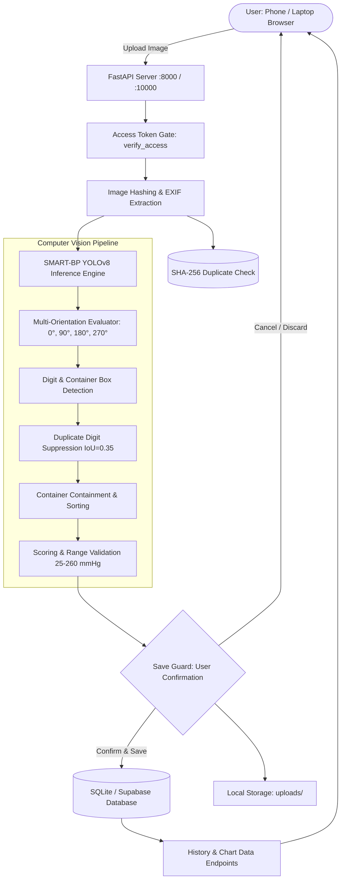

# SMART-BP Blood Pressure Tracker

[](https://www.python.org/)
[](https://fastapi.tiangolo.com/)
[](https://docs.ultralytics.com/)
[](https://pytorch.org/)
[](https://www.docker.com/)
[](#license)

**SMART-BP Blood Pressure Tracker** is an end-to-end, privacy-focused health monitoring platform that automatically transcribes digital blood pressure readings directly from monitor screen photographs using customized YOLOv8 deep learning models. 

Designed for local-first execution on Windows laptops, Docker containers, and cloud deployment on Render, the system pairs offline computer-vision digit extraction with interactive health analytics, EXIF timestamp recovery, duplicate prevention, and zero-internet client dashboards.

---

## Table of Contents

- [Overview & Purpose](#overview--purpose)
- [Key Features](#key-features)
- [Screenshots](#screenshots)
- [Technology Stack](#technology-stack)
- [System Architecture](#system-architecture)
- [Project Directory Structure](#project-directory-structure)
- [Prerequisites](#prerequisites)
- [Local Installation & Setup (PowerShell)](#local-installation--setup-powershell)
- [Docker Deployment](#docker-deployment)
- [Render Cloud Deployment](#render-cloud-deployment)
- [Environment Variables](#environment-variables)
- [Access Token Security](#access-token-security)
- [Database Persistence, Backup & Restore](#database-persistence-backup--restore)
- [Remote & Mobile Access (Android / LAN)](#remote--mobile-access-android--lan)
- [API Documentation](#api-documentation)
- [Testing & Quality Assurance](#testing--quality-assurance)
- [Security & Privacy Considerations](#security--privacy-considerations)
- [Known Limitations & Roadmap](#known-limitations--roadmap)
- [Contributing](#contributing)
- [License](#license)

---

## Overview & Purpose

Manual entry of blood pressure readings is error-prone, tedious, and frequently leads to missing health logs. The **SMART-BP Tracker** eliminates manual data entry by processing photos taken with standard smartphone cameras or uploaded through web interfaces:

1. **Computer Vision Extraction**: Locates numerical digit displays and measurement containers for Systolic (SYS), Diastolic (DIA), and Pulse (PUL) on digital monitors.
2. **Clinical Verification Workflow**: Implements a strict "save guard" where machine predictions require human verification before being committed to the permanent database.
3. **Privacy First**: Sensitive health records and original photographs remain on your local machine or private container volume. No medical data is transmitted to third-party cloud APIs.

---

## Key Features

- **Automated Photo Digitization**:
  - Pretrained YOLOv8 models (`SMART-BP+` and `SMART-BP`) trained specifically on digital monitor displays.
  - Multi-orientation automated inference: tests rotations ($0^\circ, 90^\circ, 180^\circ, 270^\circ$) to transcribe landscape and sideways smartphone photos without manual pre-rotation.
  - Overlap and duplicate suppression algorithm (`IoU = 0.35`) resolving clustered 7-segment digit bounding boxes.
  - LCD glare safeguard: detects partial or obscured readouts and gracefully marks unreadable fields without hallucinating false numbers.

- **Batch Processing & EXIF Extraction**:
  - Sequential multi-image upload with real-time thumbnail generation.
  - Automatic extraction of EXIF metadata (`DateTimeOriginal` / `DateTimeDigitized`) calibrated with timezone offset support (e.g., `Asia/Kolkata`).
  - SHA-256 content hashing to detect and prevent duplicate image uploads.

- **Interactive Health Dashboard**:
  - Built with responsive HTML5, modern CSS, and touch-scrolling data tables.
  - Chronological time-series charts displaying systolic, diastolic, and pulse trends with American Heart Association (AHA) category classification.
  - In-table inline value editing and one-click record deletion with cascading file cleanup.
  - Bundled offline Chart.js (`static/chart.umd.js`) ensuring complete dashboard functionality without internet access.

- **Ground-Truth Studio**:
  - Dedicated developer suite (`/labelingsvg` and `/labeling`) for evaluating test sets, reviewing candidate OCR predictions, and exporting verified datasets to CSV and JSON.

- **Containerized & Cloud Ready**:
  - Multi-platform Docker container utilizing headless OpenCV (`opencv-python-headless`) to eliminate GUI X11 dependencies.
  - Ready-to-deploy Infrastructure-as-Code blueprint for Render (`render.yaml`).
  - Docker Compose configuration mounting named local volumes for database and photograph persistence across container restarts.

---

## Screenshots

> *Place application screenshots into the `docs/screenshots/` folder to populate these previews.*

| Dashboard & AI Digitization | BP History & Analytics |
|:---:|:---:|
|  <br> *(Placeholder: Single & Batch Photo Inference with Confirmation)* |  <br> *(Placeholder: Interactive Chronological Chart.js View)* |

| Mobile View (Android Browser) | Ground-Truth Studio |
|:---:|:---:|
|  <br> *(Placeholder: Responsive Mobile Layout on Port 8000)* |  <br> *(Placeholder: SVG Annotation and Dataset Verification Interface)* |

---

## Technology Stack

| Layer | Technology | Description |
|---|---|---|
| **Backend Framework** | [FastAPI](https://fastapi.tiangolo.com/) `v0.110+` | High-performance Python async REST API |
| **ASGI Server** | [Uvicorn](https://www.uvicorn.org/) `v0.28+` | Single-worker server optimized for PyTorch inference |
| **Deep Learning** | [Ultralytics YOLOv8](https://docs.ultralytics.com/) `v8.2+` | Object detection for digit & container recognition |
| **ML Runtime** | [PyTorch (CPU)](https://pytorch.org/) `v2.2+` | Lightweight CPU wheel distribution (~1.2GB image footprint) |
| **Image Processing** | [OpenCV Headless](https://pypi.org/project/opencv-python-headless/) `4.10.0.84`, [Pillow](https://python-pillow.org/) `10.0+` | Image preprocessing, EXIF parsing, rotation matrix |
| **Database** | SQLite3 / [Supabase Python](https://supabase.com/) `v2.4+` | Configurable local disk SQLite or optional cloud sync |
| **Frontend** | Vanilla JavaScript, HTML5, CSS3 | Zero frontend build step; lightweight and fast |
| **Visualizations** | [Chart.js](https://www.chartjs.org/) (Offline UMD) | Interactive chronological time-series tracking |
| **Containerization** | Docker, Docker Compose | Multi-stage Linux container with persistent volume mounts |

---

## System Architecture



---

## Project Directory Structure

```
smart-bp-tracker/
├── 21269694/                      # Pretrained YOLOv8 research weights (Clifford Lab)
│   └── cliffordlab/BP_image_digitize-v1.1.0/
│       └── .../Saved_Models/
│           ├── SMART-BP+_Weights.pt
│           └── SMART-BP_Weights.pt
├── static/                        # Frontend assets served by FastAPI
│   ├── index.html                 # Main dashboard UI (upload, history, charts)
│   ├── chart.umd.js               # Offline Chart.js bundle
│   └── labeling.html              # Ground-Truth Annotation Studio
├── test_images/                   # Verification and benchmark fixtures
│   ├── synthetic_ihealth_120_80_72.png
│   └── notebook_sample_1.png
├── api_server.py                  # Core FastAPI application & REST endpoints
├── smart_bp_inference.py          # YOLOv8 inference engine & OCR transcription logic
├── database.py                    # SQLite schema, migrations & Supabase connector
├── exif_utils.py                  # EXIF timestamp extraction & thumbnail generation
├── storage.py                     # Safe image storage, traversal checks & ZIP backup
├── dataset_manager.py             # Ground-truth inventory indexing and export
├── cli_infer.py                   # Standalone command-line inference utility
├── test_integration.py            # Comprehensive 17-suite automated test harness
├── start_local.ps1                # PowerShell launcher for Windows local execution
├── Dockerfile                     # Hardened headless Linux container definition
├── docker-compose.yml             # Local Docker Compose setup with persistent volume
├── render.yaml                    # Render Infrastructure-as-Code deployment blueprint
├── requirements.txt               # Pinned Python production dependencies
├── .dockerignore                  # Image exclusion rules (health data, venv, secrets)
├── .gitignore                     # Git tracking exclusions
└── README.md                      # Project documentation
```

---

## Prerequisites

Before setting up the project, ensure your environment meets these requirements:

- **Operating System**: Windows 11 / Windows 10, macOS, or modern Linux (Ubuntu 22.04+).
- **Python**: Version `3.10` or `3.11` (Python 3.11 recommended).
- **Git**: Installed and available in PATH.
- **Docker Desktop** *(Optional, for container deployment)*: Docker v24+ with Compose v2+.
- **Hardware**: Any modern 64-bit x86/ARM CPU (minimum 4GB RAM recommended for PyTorch CPU model inference).

---

## Local Installation & Setup (PowerShell)

### 1. Clone the Repository

```powershell
git clone https://github.com/AbhishayMamidi/smart-bp-tracker.git
cd "smart-bp-tracker"
```

### 2. Create and Activate Virtual Environment

```powershell
python -m venv .venv
.\.venv\Scripts\Activate.ps1
```

### 3. Install Dependencies

Install pinned CPU-optimized PyTorch wheels and dependencies:

```powershell
python -m pip install --upgrade pip
pip install -r requirements.txt
```

### 4. Configure Local Environment Secrets

Create a `.env` file in the project root:

```powershell
# Create .env with a secure private passkey
Set-Content -Path ".env" -Value "LOCAL_APP_ACCESS_TOKEN=your-private-passkey-here"
```

*(Note: If no token is configured, the server automatically generates a secure 24-character session passkey upon launch and prints it in the console).*

### 5. Launch the Local Server

Run using the provided PowerShell startup script:

```powershell
.\start_local.ps1
```

Or run directly with Python:

```powershell
$env:PORT = "8000"
$env:HOST = "0.0.0.0"
python api_server.py
```

Open your browser and navigate to:
```
http://localhost:8000/
```

---

## Docker Deployment

The application includes a hardened Docker configuration using CPU-optimized PyTorch and headless OpenCV, keeping the image compact and eliminating X11/GUI runtime dependencies.

### 1. Build and Run with Docker Compose (Recommended)

```powershell
cd "C:\Users\Abhishay Mamidi\Documents\BP tracker"

# Optional: Set your access passkey before launching
$env:APP_ACCESS_TOKEN = "your-private-passkey-here"

# Build and start container in detached mode
docker compose up -d --build
```

### 2. Verify Container Health & Status

```powershell
# View running container status
docker compose ps

# Inspect live container logs
docker compose logs -f
```

The container performs an internal health check against `http://127.0.0.1:8000/api/health` and will report `healthy` once PyTorch model weights are loaded.

### 3. Stopping and Restarting

```powershell
# Restart container
docker compose restart

# Stop container (Preserves database and uploaded photos in named volume 'bp_data')
docker compose down

# CAUTION: Stop and completely purge persistent data
docker compose down -v
```

### 4. Manual Docker CLI Commands

If running without Docker Compose:

```powershell
# Build image
docker build -t smart-bp-tracker:local .

# Run with persistent volume mount
docker run -d `
  --name smart-bp-tracker `
  -p 8000:8000 `
  -e PORT=8000 `
  -e HOST=0.0.0.0 `
  -e APP_ACCESS_TOKEN="your-private-passkey-here" `
  -e DATABASE_PATH=/var/data/bp_tracker.db `
  -e UPLOADS_DIR=/var/data/uploads `
  -v bp_data:/var/data `
  --restart unless-stopped `
  smart-bp-tracker:local
```

---

## Render Cloud Deployment

The repository includes a ready-to-use Render Blueprint (`render.yaml`).

### Render Architecture Overview

- **Port & Host**: Render assigns an ephemeral `$PORT` (default `10000`) and expects traffic on `0.0.0.0`. `api_server.py` automatically detects the Render environment and adapts its default port accordingly.
- **Storage Differences**:
  - *Local Docker*: Uses Docker named volume (`bp_data`) mounted to `/var/data`.
  - *Render Free Tier*: Does not support persistent disks. Ephemeral storage is cleared on restart/sleep. To retain readings on the Free Tier, connect an external Supabase database using `SUPABASE_URL` and `SUPABASE_SERVICE_ROLE_KEY`.
  - *Render Paid Tier ($7/mo Starter)*: Attach a 1GB Persistent Disk mounted at `/var/data` to preserve SQLite files across deploys.

### Deploying to Render

1. Push your repository to GitHub.
2. In the [Render Dashboard](https://dashboard.render.com/), select **New** > **Blueprint**.
3. Select your `smart-bp-tracker` repository. Render reads `render.yaml` automatically.
4. Set your private environment variables in the Render Dashboard:
   - `APP_ACCESS_TOKEN`: Your secret token for unlocking the web interface.
   - `BP_USER_ID`: Identifier for records (e.g., `my_health_records`).
   - *(Optional)* `SUPABASE_URL` & `SUPABASE_SERVICE_ROLE_KEY`: If using Supabase for persistence.

Your cloud instance will be live at:
```
https://smart-bp-tracker.onrender.com
```

---

## Environment Variables

All configuration is managed through environment variables or a local `.env` file:

| Variable | Default Value | Description |
|---|---|---|
| `APP_ACCESS_TOKEN` | *(Auto-generated)* | Primary secret token for unlocking health endpoints and UI. |
| `LOCAL_APP_ACCESS_TOKEN` | `""` | Local development token (prioritized over `APP_ACCESS_TOKEN` when not on Render). |
| `PORT` | `8000` (Local) / `10000` (Render) | HTTP port bound by Uvicorn. |
| `HOST` | `0.0.0.0` | Network interface to bind (binds all interfaces for LAN/phone access). |
| `DATABASE_PATH` | `bp_tracker.db` | Absolute or relative file path to the SQLite database. |
| `UPLOADS_DIR` | `data/uploads/` | Directory where uploaded blood pressure photos are stored. |
| `BACKUPS_DIR` | `data/backups/` | Directory where automated database backup ZIP archives are written. |
| `BP_USER_ID` | `personal_owner` | User scoping key separating records across distinct users. |
| `MAX_UPLOAD_SIZE_MB` | `20` | Maximum allowable payload size for single or batch uploads. |
| `SUPABASE_URL` | `None` | Optional Supabase cloud project URL for remote synchronization. |
| `SUPABASE_SERVICE_ROLE_KEY`| `None` | Service role key for authorized Supabase database operations. |
| `RENDER` / `RENDER_SERVICE_ID` | `None` | Auto-populated by Render environment to trigger production defaults. |

---

## Access Token Security

To prevent unauthorized access to personal medical data:

1. **Authentication Gate**: All endpoints accessing personal health history, stats, image uploads, batch digitization, backups, and deletion require a valid access token.
2. **Flexible Authentication**: The token can be supplied via:
   - `X-Access-Token` request header
   - `Authorization: Bearer <token>` header
   - URL query parameter `?token=<token>` (used for loading authenticated image tags)
3. **Constant-Time Verification**: Server-side comparison utilizes Python's `secrets.compare_digest` to prevent timing attacks.
4. **Browser Session Storage**: When entered into the UI passkey modal, the token is saved in browser `localStorage` and automatically attached to future requests.
5. **No Secret Leakage**:
   - The `/api/health` endpoint reports operational status without revealing filesystem paths, tokens, or environment keys.
   - `.env`, `*.key`, and `*.pem` are excluded in `.gitignore` and `.dockerignore`.

---

## Database Persistence, Backup & Restore

### SQLite Schema (`bp_readings`)

Readings are stored in a structured SQLite table with automated index optimization:

```sql
CREATE TABLE bp_readings (
    id INTEGER PRIMARY KEY AUTOINCREMENT,
    user_id TEXT DEFAULT 'personal_owner',
    timestamp TEXT NOT NULL,
    sys INTEGER NOT NULL,
    dia INTEGER NOT NULL,
    pulse INTEGER,
    category TEXT,
    model_variant TEXT,
    confidence REAL,
    original_sys INTEGER,
    original_dia INTEGER,
    original_pulse INTEGER,
    was_corrected INTEGER DEFAULT 0,
    notes TEXT,
    image_hash TEXT,
    image_filename TEXT,
    capture_date_source TEXT,
    image_path TEXT,
    created_at TEXT DEFAULT CURRENT_TIMESTAMP
);
```

### Automated Backup Generation

You can create an instant snapshot of your SQLite database and all uploaded photographs:

- **Via REST API**:
  ```powershell
  Invoke-RestMethod -Uri "http://localhost:8000/api/backup" -Method Post -Headers @{"X-Access-Token"="YOUR_TOKEN"}
  ```
- **Storage Location**: Archives are saved to the configured `BACKUPS_DIR` as `bp_backup_YYYYMMDD_HHMMSS.zip`.
- **Zip-Slip Protection**: The restoration routine in `storage.py` inspects every archive path entry to guarantee no files can be extracted outside the designated data directory.

---

## Remote & Mobile Access (Android / LAN)

Because the server binds to `HOST=0.0.0.0`, you can access the tracker from your smartphone or tablet connected to the same Wi-Fi network:

1. Launch the server using `.\start_local.ps1` (it automatically detects and displays your local IPv4 address).
2. Alternatively, find your Wi-Fi IPv4 address manually in PowerShell:
   ```powershell
   (Get-NetIPAddress -AddressFamily IPv4 | Where-Object { $_.InterfaceAlias -notmatch "Loopback|Virtual" }).IPAddress
   ```
3. Open your mobile browser (e.g., Chrome on Android) and enter:
   ```
   http://<YOUR_LAPTOP_IP>:8000/
   ```
4. Enter your passkey when prompted to access your dashboard, take photos with your phone camera, and digitize readings on your laptop in real time.

---

## API Documentation

All endpoints require authentication (except health checks and the static frontend root).

### Health & System Status

#### `GET /api/health`
- **Auth**: None
- **Response**:
  ```json
  {
    "status": "healthy",
    "device": "CPU",
    "models": {
      "SMART-BP+": {"loaded": true, "size_mb": 21.5},
      "SMART-BP": {"loaded": true, "size_mb": 21.48}
    },
    "default_variant": "SMART-BP+",
    "database": {"type": "SQLite (persistent)", "connected": true},
    "auth_enabled": true
  }
  ```

---

### Image Inference & Digitization

#### `POST /api/read-bp-image`
Transcribes a single uploaded BP monitor photograph.
- **Auth**: Required
- **Content-Type**: `multipart/form-data`
- **Parameters**:
  - `file`: Image file (JPEG, PNG, WebP)
  - `model_variant`: `"SMART-BP+"` (default) or `"SMART-BP"`
- **Response**:
  ```json
  {
    "status": "success",
    "readings": {"sys": 120, "dia": 80, "pul": 72},
    "confidence": 0.983,
    "confidence_pct": 98.3,
    "applied_rotation": 0,
    "category": "Normal",
    "message": "Successfully extracted readings: SYS=120, DIA=80, PUL=72",
    "annotated_image": "data:image/jpeg;base64,...",
    "image_hash": "a1b2c3d4...",
    "exif_metadata": {
      "has_capture_date": true,
      "capture_date": "2026-09-15T07:45:00",
      "display_datetime": "15 Sep 2026, 07:45"
    }
  }
  ```

#### `POST /api/batch-process`
Processes multiple photos sequentially, extracting EXIF dates and generating thumbnails.
- **Auth**: Required
- **Content-Type**: `multipart/form-data`
- **Parameters**: `files` (array of uploaded images)
- **Response**:
  ```json
  {
    "success": true,
    "total_uploaded": 3,
    "summary": {"successful": 3, "partial": 0, "unreadable": 0, "duplicate": 0},
    "items": [
      {
        "id": "batch_item_0",
        "original_filename": "IMG_01.jpg",
        "image_hash": "e3b0c44...",
        "readings": {"sys": 135, "dia": 88, "pul": 68},
        "exif": {"has_capture_date": true, "capture_date": "2026-09-15T08:30:00"},
        "thumbnail": "data:image/jpeg;base64,..."
      }
    ]
  }
  ```

---

### Record Confirmation & History

#### `POST /api/confirm-reading`
Commits a verified reading to the database.
- **Auth**: Required
- **Body**:
  ```json
  {
    "timestamp": "2026-09-15T08:30:00",
    "sys": 135,
    "dia": 88,
    "pulse": 68,
    "category": "Stage 1 Hypertension",
    "model_variant": "SMART-BP+",
    "confidence": 0.95,
    "was_corrected": 0,
    "notes": "Morning reading after breakfast",
    "image_hash": "e3b0c44...",
    "image_filename": "IMG_01.jpg"
  }
  ```

#### `GET /api/history`
Retrieves chronologically sorted blood pressure history for the active user.
- **Auth**: Required
- **Query Parameters**:
  - `limit`: Integer (default `100`)
  - `offset`: Integer (default `0`)
  - `start_date`: ISO format filter (`YYYY-MM-DD`)
  - `end_date`: ISO format filter (`YYYY-MM-DD`)

#### `DELETE /api/history/{reading_id}`
Deletes a reading and safely unlinks its stored photograph file.
- **Auth**: Required

#### `GET /api/chart-data`
Retrieves optimized datasets formatted specifically for Chart.js rendering.
- **Auth**: Required

---

### Ground-Truth Studio

#### `GET /api/dataset/images`
Returns inventory of development dataset images with current annotations.

#### `POST /api/dataset/save-label`
Saves verified ground-truth values for algorithm evaluation.

#### `GET /api/dataset/export?format=csv`
Exports the dataset annotations in standard CSV format.

---

## Testing & Quality Assurance

The project includes an end-to-end automated integration suite (`test_integration.py`) covering 17 critical subsystems:

```powershell
# Run the complete test suite
.\.venv\Scripts\python.exe test_integration.py
```

### Test Suite Coverage

| Test | Subsystem Tested | Key Assertions |
|---|---|---|
| **Test 1** | Model Loading | Verifies weights load on CPU without error |
| **Test 2** | Health Endpoints | Verifies `/api/health`, `/health`, `/healthz` return `200 OK` |
| **Test 3** | Dual Model Inference | Tests `SMART-BP+` and `SMART-BP` against reference fixture |
| **Test 4** | Save Guard & Config DB | Verifies inference does not alter DB without explicit confirmation |
| **Test 5** | Payload & Error Limits | Enforces 20MB limit and clean rejection of corrupted files |
| **Test 6** | File Integrity | Checks for required models and deployment files |
| **Test 7** | Access Token Security | Validates 10 distinct authentication scenarios |
| **Test 8** | Security Headers | Confirms CSP, X-Frame-Options, and path sanitization |
| **Test 9** | Multi-Tenant Scoping | Verifies cross-user record isolation |
| **Test 10** | Batch EXIF Processing | Validates date parsing, timezone handling, and thumbnails |
| **Test 11** | Duplicate Prevention | Enforces SHA-256 duplicate detection and timestamp validation |
| **Test 12** | Chart.js Data & Filters | Tests chronological sorting (ASC) and date range filtering |
| **Test 13** | EXIF Utils Regression | Confirms `exif_utils` module availability and Dockerfile COPY |
| **Test 14** | Batch Response Contract| Tests defensive property resolution on batch responses |
| **Test 15** | Local Auth & Storage | Confirms image file cleanup, directory traversal blocks, and ZIP backup |
| **Test 16** | Ground-Truth Studio | Tests `/labelingsvg`, dataset inventory, and CSV/JSON export |
| **Test 17** | Scientific Regression | Benchmarks 33 verified ground-truth monitor photos |

---

## Security & Privacy Considerations

- **Private Medical Data Protection**:
  - No personal blood pressure logs or medical images are committed to Git or pushed to third-party APIs.
  - `.gitignore` and `.dockerignore` strictly exclude `*.db`, `uploads/`, `data/`, `backups/`, `.env`, and private test sets.
- **Directory Traversal Mitigation**:
  - `storage.py` and `dataset_manager.py` enforce strict boundary checks using `os.path.commonpath` to neutralize Zip-Slip and path-traversal attacks.
- **Timing Attack Prevention**:
  - Authentication checks use constant-time `secrets.compare_digest` to prevent token timing analysis.
- **Single-Worker Concurrency**:
  - Uvicorn runs with `workers=1` to prevent duplicate PyTorch model allocation in container environments.

---

## Known Limitations & Roadmap

### Implemented & Verified
- [x] YOLOv8-based digital readout OCR.
- [x] Multi-orientation automated inference (0°, 90°, 180°, 270°).
- [x] Batch photo upload with EXIF capture date extraction.
- [x] Duplicate image detection via SHA-256 hashing.
- [x] Local SQLite and optional Supabase cloud storage.
- [x] Responsive web dashboard with offline Chart.js.
- [x] Ground-Truth Studio for dataset annotation.
- [x] Docker and Render deployment configurations.

### Known Limitations
- **Severe LCD Glare**: Direct camera flash or reflections obscuring 7-segment digits may cause the model to return partial readings. (The engine safely marks these as partial/unreadable rather than guessing).
- **CPU Resource Usage**: Running batch inference on large batches (10+ high-resolution images) on low-spec CPUs may require 1–2 seconds per image.

### Planned Enhancements
- [ ] Progressive Web App (PWA) offline caching with service workers.
- [ ] Web Bluetooth API integration for direct wireless cuff connectivity.
- [ ] PDF report generation formatted for physician visits.
- [ ] Export to HL7 / FHIR clinical standards.

---

## Contributing

1. Fork the repository on GitHub.
2. Create a feature branch:
   ```powershell
   git checkout -b feature/your-feature-name
   ```
3. Ensure all integration tests pass cleanly:
   ```powershell
   python test_integration.py
   ```
4. Verify no private data or secrets are staged:
   ```powershell
   git status
   ```
5. Submit a pull request with a detailed description of your changes.

---

## License

No root license has been specified for this repository.

*(Note: Pretrained deep learning weights and research artifacts located in the `21269694/` subdirectory are subject to the research license provided by Clifford Lab / Emory University in `21269694/cliffordlab/BP_image_digitize-v1.1.0/cliffordlab-BP_image_digitize-e681187/LICENSE`).*
